+++
title = "Two months in Japan, spent without a plan"
date = 2024-08-26T21:22:11+01:00
draft = false
+++

It's almost over. Two months in Japan, spent without a plan.

I rented a small apartment in Tokyo. Which is as vague as saying "In Flanders." Because Tokyo doesn't have a specific center; it's a conglomeration of many neighborhoods. So, more specifically, I lived in Ootsuka for two months, which is right next to Ikebukuro.

I first came to Japan in December last year. Japan has fascinated me my entire life. When I was on a school trip to Bruges and accidentally hit my nose on a statue, I had to go to the emergency room. I told the doctor after he pressed a compress on my nose, "Look, the flag of Japan." My earliest memory as a 10-year-old. It was written in the stars, at least in the stars I saw after hitting my nose.

Anyway, I was a speaker at a conference and spent 5 days in Tokyo. Those days flew by, and my hunger was far from satisfied. Such a different world, almost too good to be true. I wanted to be here and absorb the culture.

So, in February, I started learning Japanese on Duolingo. If you want to torture your brain, I highly recommend learning Japanese. Words come in one ear and fly out the other. If I hear a word 10 times, it might stick with some luck. If I hear it 100 times, I can pronounce it as smoothly as a samurai. Unfortunately, there are a lot of words.

And I haven't even mentioned the alphabet. There's Hiragana, Katakana (used to describe the sounds of foreign words, like "kompyuuta," "erebeeta," "shoowaa," ...), and then there are thousands of Kanji characters borrowed from Chinese. One sentence usually contains a mix of the three, and they don't use spaces, so you have to feel when the next word starts.

Now, six months later, I'm almost at the level of a preschooler. A preschooler who can order whiskey in a bar, say "enjoy your meal," and, most importantly, knows how to start a conversation politely. Many Japanese people barely speak English. And that's okay because the center of the world isn't necessarily in the West. So, learning the language is the key to connecting with the locals. It's worth all the brain pain and is greatly appreciated.

Two months sounds long, but it isn't. Every day I gain a little more insight into the complex culture, and I still have so much to learn. But... I can only write with what I know now, so you'll have to make do with that. 🙂

The past two months haven't just been a trip for me; they've been a discovery. It's the first place where I find such peace. Although I know this wouldn't necessarily be the case for many of you. So please don't impulsively jump away from your computer to sell your house and emigrate. I don't want that on my conscience.

The thing is, Japan happens to suit my personality very well. The people here are very gentle; much is left unsaid but must be felt. "Reading the air." Japanese people are very shy, but at the same time, very interested and usually happy when you start a conversation. And once they're in the mood, they can keep going until 5 in the morning, sounding more and more like samurais, and almost everyone sings karaoke without shame. Before you know it, you're getting hugs and hearing "thank you" 100 times.

Many foreigners are confused by all this "air reading." Let me give you an example, completely coincidentally from a bar, which has nothing to do with my habits, of course... 🙂 Ordering a beer isn't done by just walking up to the bartender and bluntly saying "a beer." That's a bit too direct. First, you nod and say hello politely. Then you ask for a beer politely. A subtle difference, but a big difference. You can apply this to almost every encounter and interaction.

There's hardly any macho behavior here. A popular phrase, for example, is "Yoroshiku onegai shimasu." Loosely translated: "Please be kind to me." When you meet someone for the first time, you usually say "hajimemashite," which means "First time." I've never nodded so much with my head as I have in the past two months, and now I do it unconsciously. In Belgium, I'll probably unlearn that quickly, or you'll think a few (extra) screws are loose in my head.

Japanese people are also very stylish. Not necessarily snobbish; there are many vintage shops here, for example, but they are fashionable. Even men often wear jewelry and earrings, have well-groomed haircuts, and are very conscious of the clothes they wear. You have to make a real effort to attract attention with an original look.

Wow, I actually have a lot to tell. I'm going to sum up a few more things.

Japan is a very well-organized country. The trains are almost always on time, and it's standard practice to announce that you shouldn't make phone calls on the train so as not to disturb others. From 5 AM to midnight, you can get almost anywhere in Tokyo by public transport. And if you miss the last train? You can either take a nap in a love hotel. There are many of those, in all sorts of themes (a car, a train carriage, you name it, you can find it). Or you can go to a bar until 5 AM. That's pretty much the standard closing time for many bars.

There is a lot of tradition in Japan. Shinto and Buddhism are the most popular religions, often combined, but many Japanese people are quite casual about it. Many people are agnostic, but they do often believe that everything has a spirit, in mountains, rivers, ... You can also see the tradition in the streets. Among the narrow streets filled with concrete buildings, there are izakayas (a kind of traditional pub where you can also eat), restaurants, small temples, ... that breathe tradition.

Japan is super clean, and you almost never see a public trash can. That's because as children, they are taught to clean their school themselves, including the toilets. As an employee, it's also normal to be responsible for cleaning your own café or restaurant. Smokers often carry a "pocket ashtray" so that their cigarette butts don't end up on the ground. Almost every sidewalk or train station is spotless. Really impressive, what a difference from Bruges, where many people are too lazy to throw their cans in a trash can despite the many trash cans available.

If something can be made cute, it will be made cute. Everything here is made cute, "kawaii," which is also the word I hear most often here. Many things are also named based on how they feel, like "mochi mochi," something that is soft. You feel it, right?

Japanese people are on average much shorter than Belgians. I'm 1m79, and I'm almost at the upper limit of living comfortably here. There are tunnels here that are only 1m80 high; when I wash my hands, I have to seriously bend down, and if I'm not careful, I bump my head at least 10 times a day. If you're 10 cm taller than me, you'll need to renovate your house or take out a hernia insurance policy.

Japanese people work super hard, and there is a lot of pressure. At work, it's best not to speak out, but in the evening, drinking with colleagues and getting tipsy is perfectly acceptable. No one really bats an eye if you sleep drunk on the street. The pressure needs to be released; after all, they are humans like us.

Hot springs, onsens, are very popular. And super cozy. You do have to walk around naked, but don't worry, the sexes are usually separated. I've been there twice and am now quite comfortable lying in a bath full of men until I turn as red as an octopus and need to cool down.

Many Japanese people don't like to tan. You'll see all sorts of accessories here to keep the sun off your skin. Lots of umbrellas too. Finally, my pale calves are the pinnacle of a beauty ideal, something I never expected to experience.

In 2 months, I've never felt unsafe, even in the narrowest streets of the nightlife districts in the middle of the night. I can leave my smartphone, laptop, or wallet lying around, and the chance of something being stolen is minimal.

Every 200 meters, there are "konbinis," small convenience stores that are open 24/7. Literally. And where you can even file your taxes, make payments, make copies, buy a t-shirt, ... I'm going to miss that; it's so practical. Also dangerous; someone with no limits can get a drink here at any time of the day.

Smoking here is very bizarre. There's almost a universal smoking ban in public spaces. You have to go to a "smoking area," of which there aren't many. Or... go to a bar, where in many bars, you can smoke inside. It's the reverse world, very rock 'n roll but not exactly healthy or pleasant. Of course, there are also many bars that don't allow it or have a smoking room. But I feel like I've been catapulted back to 2007.

Right now, it's very affordable for us to stay in Japan because the Yen is not doing well. You can easily eat gyoza, ramen, and drink half a liter of beer for a total of 11 Euros. So I haven't cooked much since I've been here. 🙂

Okay, I'm almost tired of typing. And I need to save something to tell you when I see you. So, one last impression. Japanese people are super inventive. An eye mask that heats up when you take it out of the package? Check. A bodysuit that cools you down? Check. Toilets that refill through a tap so you can wash your hands immediately after flushing? Check.

I'm flying back on Saturday, but I'm already thinking about how I can come back here. I've lost my heart here, but unfortunately, it's very far from everything dear to me in Belgium (especially you, my family and friends; the rest I could do without). I hope you've learned something about this fascinating country. 🙂

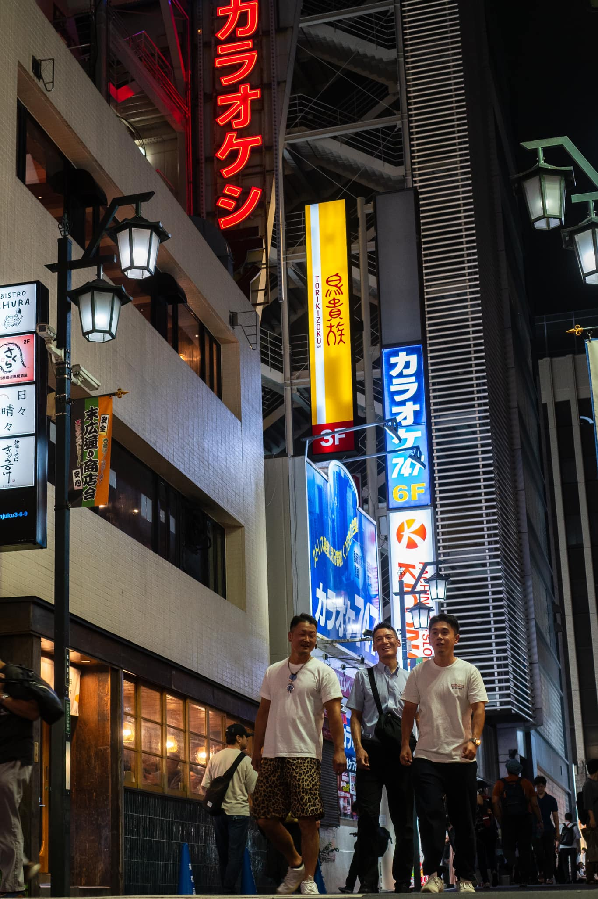
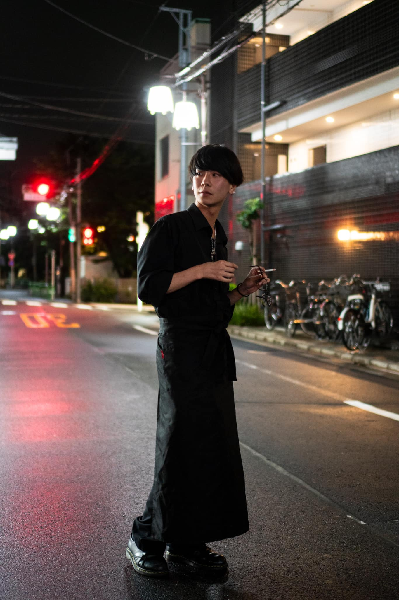
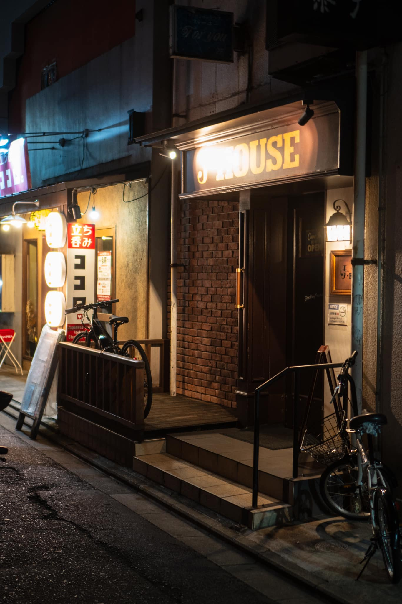
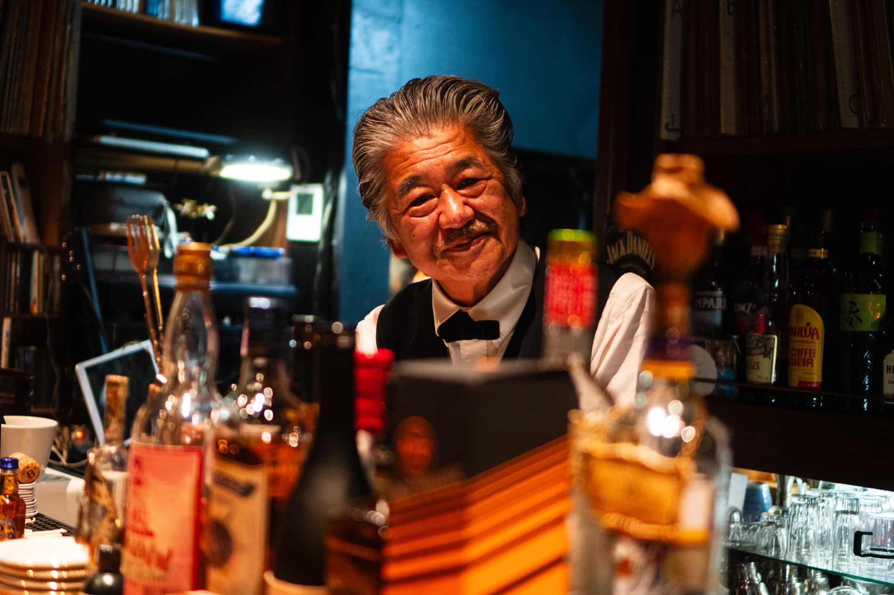
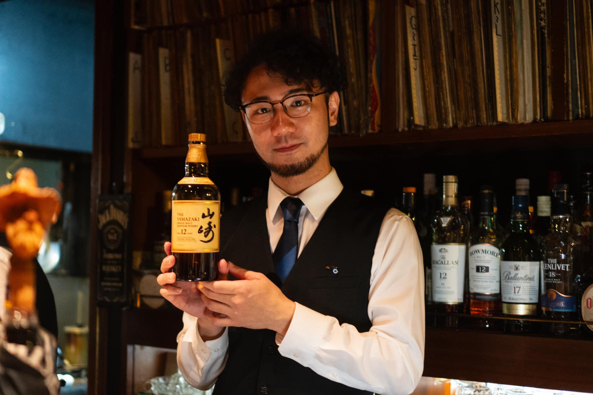
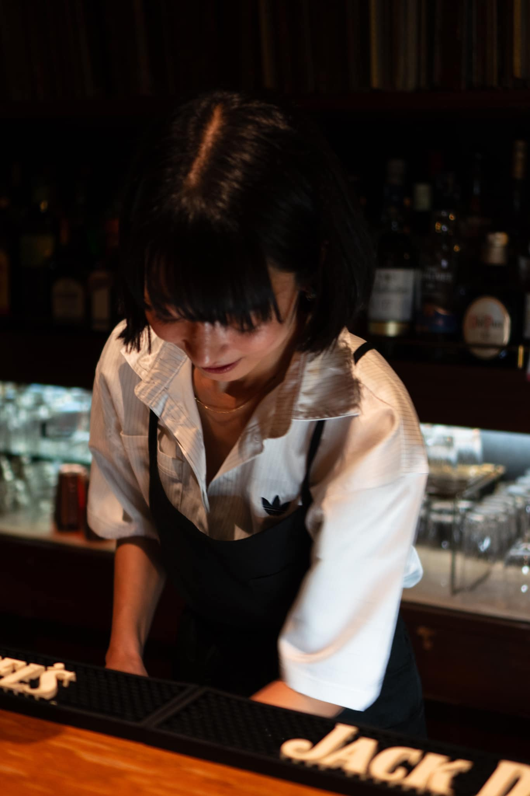
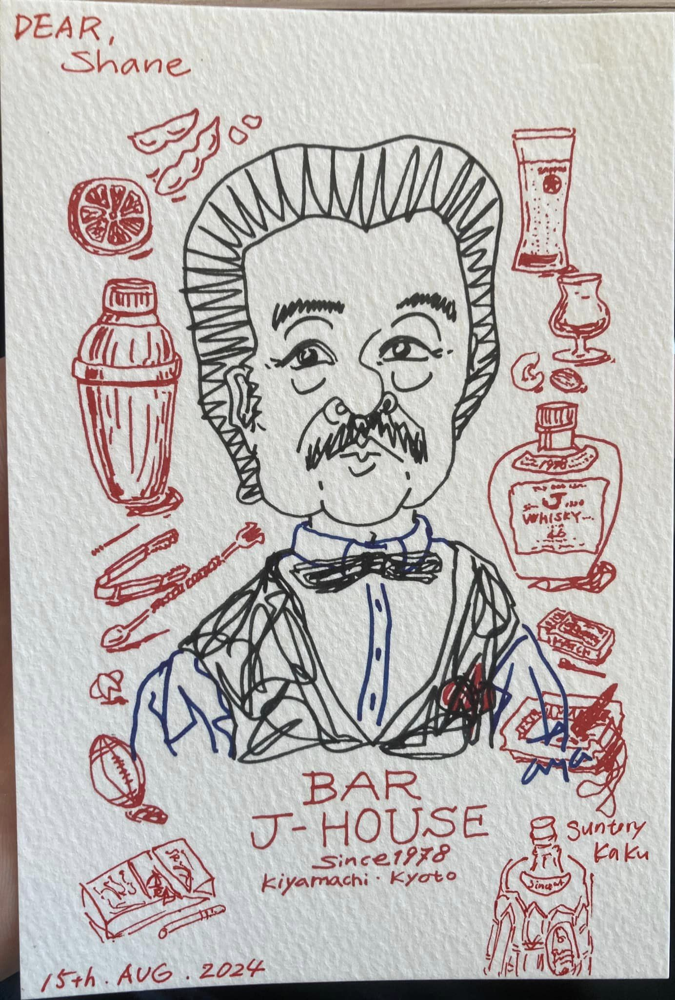
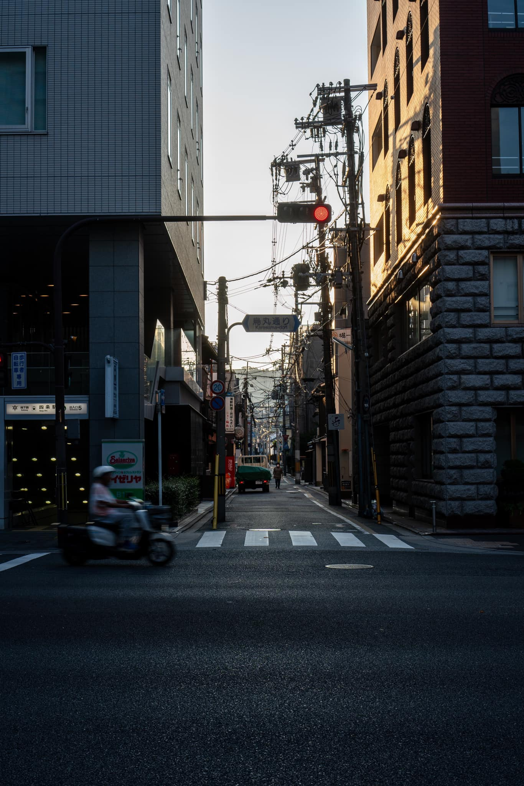
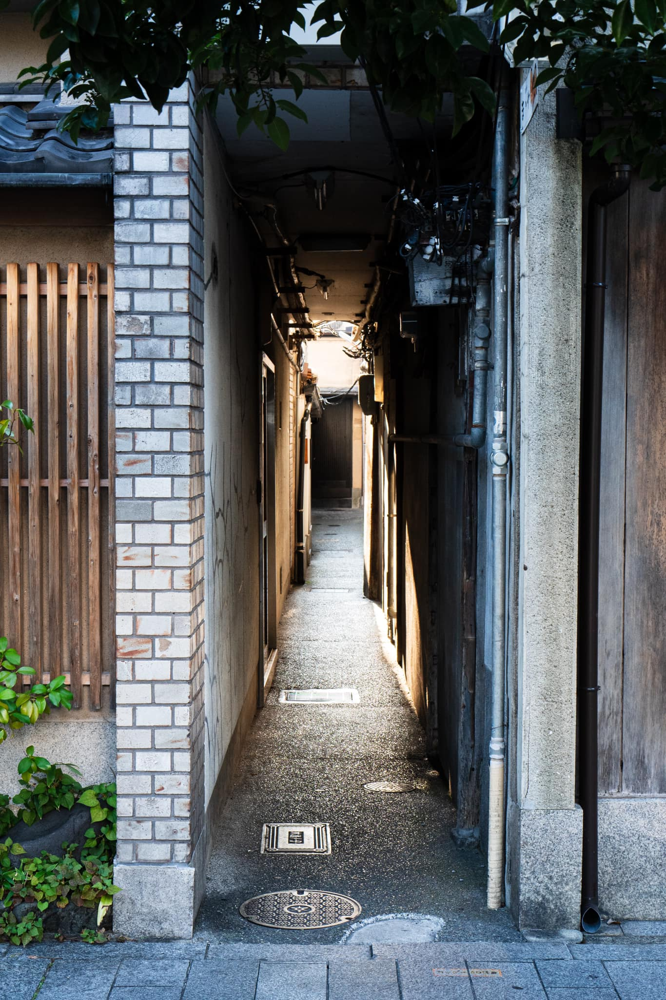

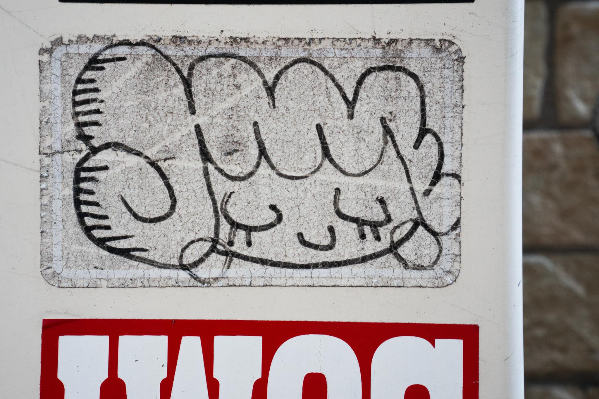
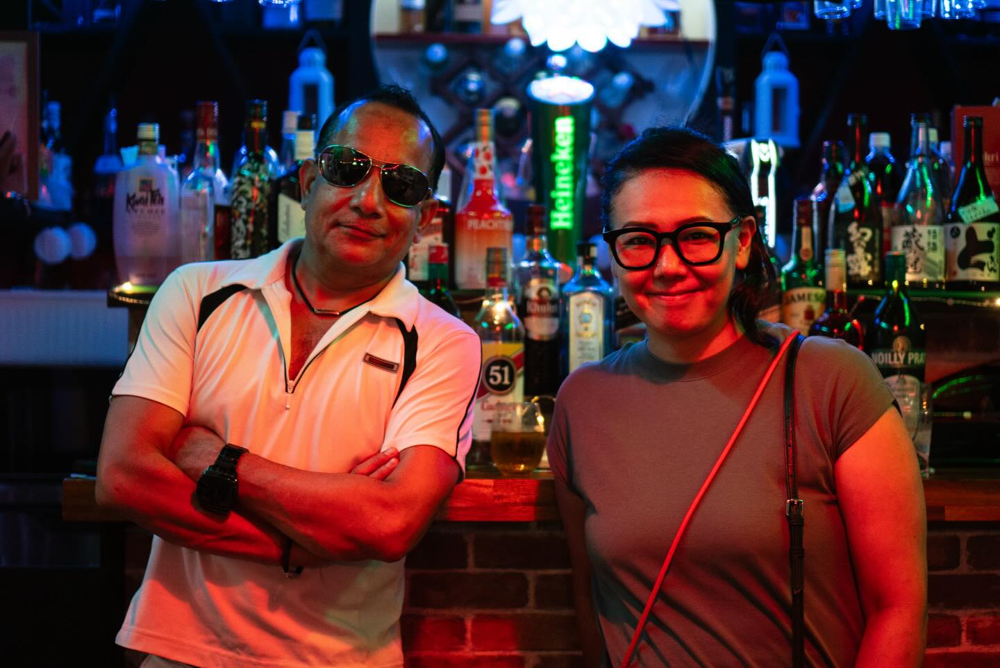